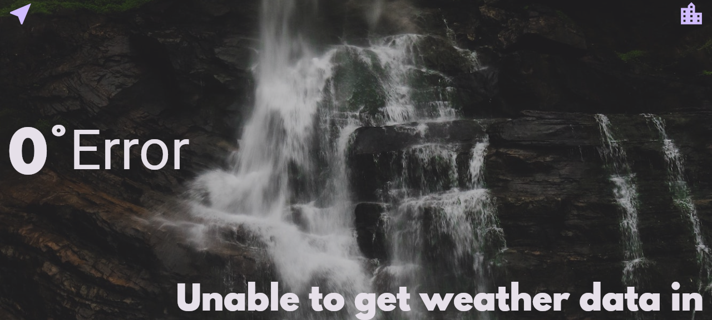

# Clima - Weather App

A Flutter app that shows current weather for your location, or for any city you search, using the OpenWeatherMap API.

## Preview

The screenshot above is a web build served locally: geolocation is blocked in that headless context, so it shows the app's error state instead of live weather data. On a device with location permission granted it shows the current temperature, condition icon and a short message instead.

## Tech Stack

Flutter, Dart, geolocator, OpenWeatherMap API

## Running it

Built and tested with Flutter 3.32.8 / Dart 3.8.1.

1. `flutter pub get`
2. The app needs an OpenWeatherMap API key. Get a free one at openweathermap.org and set it as the `apiKey` constant in `lib/services/weather.dart`.
3. Run on a connected device or emulator with `flutter run`, or build for web with `flutter build web`.
4. Location access needs to be granted for the "use my location" button to work. The "search by city" button works without it.

## Developer

- [@kafle1](https://www.github.com/kafle1)

## Support / Contact

For support, email kafleniraj@gmail.com.
